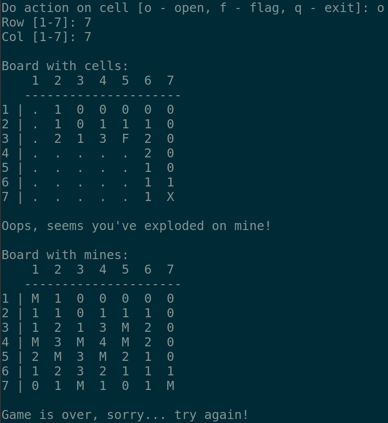

# MineSweeper In Terminal

The legendary game ported to terminal.

## Requirements

- [Java 17](https://jdk.java.net/archive/)
- [Apache Maven](https://maven.apache.org/)
- [GNU Make](https://www.gnu.org/software/make/)

## Build

    make build

## Run

    make run

## Rules

The goal of the game is to open all cells on the board and mark mines with flags.

Type of cells:

- `.` - cell not touched yet.
- `0...N` - cell shows adjacent mines number.
- `F` - cell flagged as mine.
- `X` - cell with exploded mine.
- `M` - cell with mine (shows after game is finished).

## Gameplay

### Start game

### Open cell

### Set flag

### Explode on mine

### Win another game

